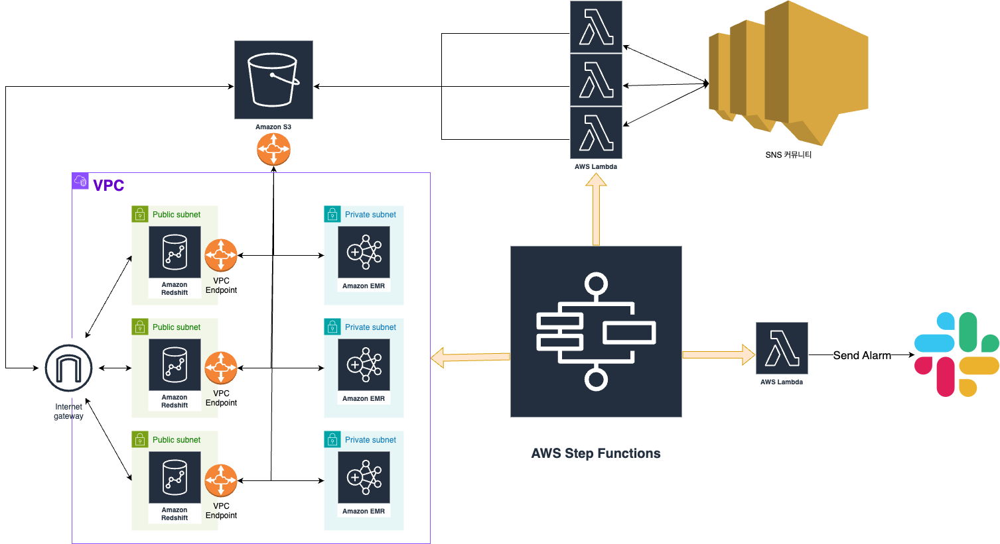

# 개요

소프티어 데이터 엔지니어 3조 팀 프로젝트에서 개발한 데이터 파이프 라인을 배포 해 볼 수 있습니다..

[AWS SAM(Serverless Application Model)](https://aws.amazon.com/ko/serverless/sam/)
을 이용하여 데이터 파이프 인프라를 코드로 관리하고 배포했습니다.

AWS Step Function을 사용하여 전체적인 워크플로우를 관리했습니다.

최상위에 있는 template.yaml에 전체 구조가 정의되어 있고 하위 폴더들에 하위 스택들이 정의되어 있습니다.

alarm, extract, load, transform, workflow 폴더에 각 스텝에 필요한
자원을 정의했습니다.

1. alarm에는 슬랙 알람을 보내는데 필요한 람다 함수를 정의했습니다.
2. extract는 SNS에서 게시글을 스크래핑해 오는 람다 함수가 정의했습니다.
3. load에는 정제된 데이터를 적재 할 수 있는 AWS Redshift를 정의했습니다.
4. transform에는 SNS에서 스크래핑한 데이터를 처리 할 때 사용하는 AWS EMR이
   필요로 하는 자원을 정의했습니다.
5. workflow에는 전체 워크플로를 관리해주는 AWS Stepfunction이 정의되어있습니다.

# 아키텍처


라우팅 테이블과 AWS SecretManager VPC Endpoint는 생략

# 배포

## 준비물

1. AWS ScretManager에 AWS Redshift용 관리자 ID와 비밀번호
2. 데이터를 처리 할 pyspark job
3. Slack 수신 웹훅 URL

AWS Redshift 관리자 ID와 비밀번호와 Slack 알람 수신 URL은 노출되면 안되기
때문에 AWS Secretmanger를 통해 관리합니다.

데이터 파이프 라인을 배포하기 전에 AWS Secretmanger에 ID,비밀번호, 슬랙 url을
등록해야합니다.

AWS SAM은 AWS SecretManage에서 해당 값들을 동적으로 참조하여 데이터 파이프 라인을 배포합니다.

정확한 보안 암호 설정법은 [(링크)](https://docs.aws.amazon.com/AWSCloudFormation/latest/UserGuide/dynamic-references.html)
를 참고하면 됩니다..

load/template.yaml, alarm/template.yaml에 보안 암호 경로가 설정되어있습니다.

데이터를 처리할 pyspark job은 S3의 다음 경로에 업로드하면 됩니다.

`s3://${EMRAssetsS3BucketName}/code/pyspark/spark-job-emr.py`

## 배포

SAM CLI는 Lambda 애플리케이션을 빌드하고 테스트할 수 있는 기능을 추가하는 AWS CLI의 확장 기능입니다.

SAM CLI는 Docker를 사용하여 Lambda와 일치하는 Amazon Linux 환경에서 함수를 실행합니다.
또한 애플리케이션의 빌드 환경과 API를 에뮬레이트할 수도 있습니다.

SAM CLI를 사용하려면 다음 도구들이 필요합니다.

* SAM
  CLI - [Install the SAM CLI](https://docs.aws.amazon.com/serverless-application-model/latest/developerguide/serverless-sam-cli-install.html)
* [Python 3 installed](https://www.python.org/downloads/)
* Docker - [Install Docker community edition](https://hub.docker.com/search/?type=edition&offering=community)

빌드와 배포를 위해서는 다음 명령어를 사용합니다.

```bash
sam build --use-container
sam deploy --guided
```

## SAM CLI를 사용하여 로컬에서 빌드하고 테스트하기

sam build --use-container 명령어를 사용하여 애플리케이션을 빌드합니다.

```bash
infra$ sam build --use-container
```

SAM CLI는 hello_world/requirements.txt에 정의된 종속성을 설치하고 배포 패키지를 생성하여 .aws-sam/build 폴더에 저장합니다.

테스트 이벤트로 함수를 직접 호출하여 단일 함수를 테스트할 수 있습니다. 이벤트는 함수가 이벤트 소스로부터 받는 입력을 나타내는 JSON 문서입니다. 이 프로젝트의 events 폴더에 테스트 이벤트가 포함되어
있습니다.

로컬에서 함수를 실행하고 sam local invoke 명령어로 호출합니다.

아래 예제에서는 보배드림 사이트를 스크래핑하여 s3에 업로드하는 람다 함수를 테스트 할 수 있습니다.

```bash
infra$ sam local invoke ExtractFunction --event extract/events/event.json
```

## 정리

생성한 샘플 애플리케이션을 삭제하려면 AWS CLI를 사용합니다. 프로젝트 이름을 스택 이름으로 사용했다고 가정하고, 다음 명령어를 실행할 수 있습니다:

```bash
sam delete --stack-name "de3-team-project"
```

## Resources

리소스
SAM 사양, SAM CLI 및 서버리스 애플리케이션 개념에 대한 소개는
[AWS SAM 개발자 가이드](https://docs.aws.amazon.com/serverless-application-model/latest/developerguide/what-is-sam.html)
를 참조하세요.

다음으로, AWS 서버리스 애플리케이션 리포지토리를 사용하여 hello world 샘플을 넘어서는 애플리케이션을 배포하고, 저자들이 애플리케이션을 개발한 방법을 배울 수 있습니다/

[AWS 서버리스 애플리케이션 리포지토리 메인 페이지](https://aws.amazon.com/serverless/serverlessrepo/)
